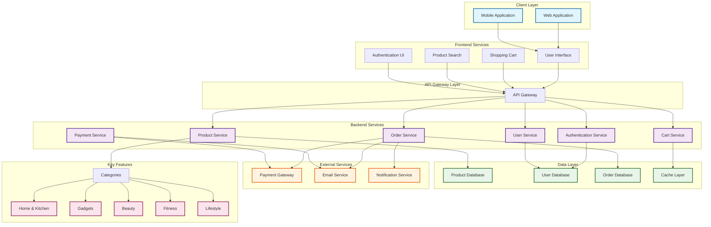

# Nolexcart Architecture Overview

Nolexcart is an online shopping platform designed to provide a seamless e-commerce experience. This document outlines the high-level architecture of the system.

## System Architecture

## Architecture Components

### Client Layer
- **Web Application**: Desktop and web browser interface for customers
- **Mobile Application**: Native or cross-platform mobile shopping app

### Frontend Services
- **User Interface**: Main product browsing and display
- **Shopping Cart**: Cart management and checkout flow
- **Product Search**: Search and filtering capabilities
- **Authentication UI**: Login and registration interface

### API Gateway Layer
- **API Gateway**: Central entry point for all frontend requests, handling routing, rate limiting, and authentication

### Backend Services
- **Authentication Service**: User login, registration, and session management
- **Product Service**: Product catalog, details, and inventory management
- **Order Service**: Order creation, tracking, and management
- **Payment Service**: Payment processing and transaction management
- **User Service**: User profile and account management
- **Cart Service**: Shopping cart operations and persistence

### Data Layer
- **Product Database**: Product information, pricing, and inventory
- **User Database**: User profiles, credentials, and preferences
- **Order Database**: Order history and transaction details
- **Cache Layer**: High-performance caching for frequently accessed data

### External Services
- **Payment Gateway**: Third-party payment processing (Stripe, PayPal, etc.)
- **Email Service**: Transactional emails (order confirmations, receipts)
- **Notification Service**: Real-time notifications and alerts

### Product Categories
Nolexcart offers diverse product categories including:
- Home & Kitchen
- Gadgets
- Beauty
- Fitness
- Lifestyle

## Key Features
✅ Trending and affordable products  
✅ Secure shopping experience  
✅ Quality product curation  
✅ Smooth user experience  
✅ Multiple product categories  
✅ Great deals and discounts  

---

*Last Updated: August 10, 2026*
